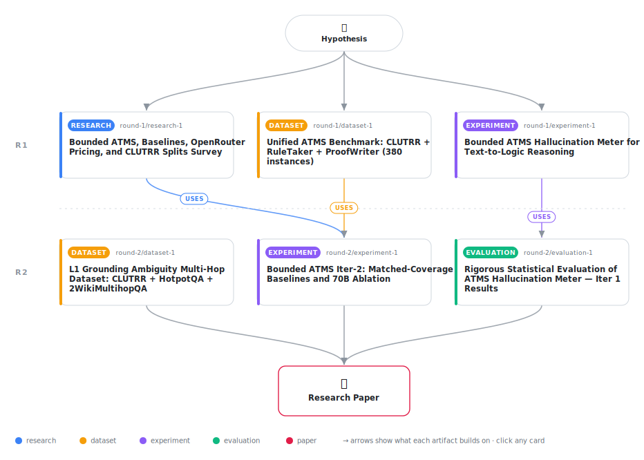

# The Empty-Environment Test: Binary Abstention via ATMS Empty-Environment Derivability Achieves High Selective Precision in Text-to-Logic Reasoning — An Auditable Alternative to ProbLog at Matched Coverage

<div align="center">

<a href="https://cdn.jsdelivr.net/gh/AMGrobelnik/ai-invention-layoutcheck-d4c705-the-empty-environment-test-binary-absten@main/workflow.svg">
<picture>
  <source media="(prefers-color-scheme: dark)" srcset="workflow-dark.svg">
  
</picture>
</a>

<sub>🖱️ <b><a href="https://cdn.jsdelivr.net/gh/AMGrobelnik/ai-invention-layoutcheck-d4c705-the-empty-environment-test-binary-absten@main/workflow.svg">Open the interactive diagram</a></b> — every card links to its artifact folder.</sub>

</div>

> **Hypothesis** — In a neuro-symbolic pipeline that translates a short document into first-order logic and reasons with a logic interpreter, the dominant mechanism by which a bounded Assumption-Based Truth Maintenance System (ATMS) reduces hallucination is BINARY ABSTENTION grounded in the empty-environment criterion — not fine-grained graduated scoring. We separate the pipeline into L1 (document-grounding, LLM-generated, fallible, measured independently) and L2 (assumption-tracking over L1 atoms). When every L2 choice is recorded as an explicit ATMS assumption and forward-chaining propagates environments up to a depth cap d, the system produces a bimodal conclusion distribution: (Class E) conclusions derivable in the empty environment (lambda=0), and (Class A) conclusions not derivable within any bounded consistent environment (lambda=inf). The empirical record after two iterations establishes: (H1, SUPPORTED BUT UNDERPOWERED) empty-environment conclusions achieve 90% precision [95% CI: 59.6%–98.2%, n=10] with L1 grounding error independently verified at 0% on the evaluated documents; the calibration-free L2 guarantee is real but the sample is too small for definitive claims — a minimum of 50 empty-environment instances is required. (H2, REFRAMED AS BINARY BOUNDARY, NOT GRADED SIGNAL) the previously-reported Spearman rho=0.629 (p<0.001) reflects a binary phenomenon: lambda=inf instances are mechanically abstained and scored as wrong, inflating the correlation; within the 11 non-abstained instances there is insufficient power (n=11) to test a graded within-answered relationship. H2 must be understood as 'the abstention boundary correlates with correctness' — a binary test — not as evidence of monotonic graduated scoring. The genuine graded monotonicity claim requires at least 100 answered instances spanning multiple lambda strata and remains unverified. (H3, REFRAMED AS AUDIT-TRAIL ADVANTAGE, NOT PRECISION ADVANTAGE) at matched 22.9% coverage, ATMS and ProbLog tie at 90.9% answered accuracy, both exceeding CoT (72.7%) and LINC (72.7%); ProbLog provides substantially higher coverage (answering 75% of the queries ATMS abstains from), and wins 30 of 36 divergent cases. The ATMS therefore provides NO precision advantage over ProbLog at matched coverage on this evaluation. The structural differentiator is the AUDIT TRAIL: the environment lattice certifies which conclusions are document-forced versus assumption-dependent in an interpretable form that ProbLog's independent-Bernoulli semantics cannot provide. The primary advantage claim is now: ATMS provides equivalent precision to ProbLog with an interpretable structural justification, at a higher abstention cost. (H4, MODEL-DEPENDENT, UNTESTED WITH CAPABLE MODELS) the 77.1% abstain rate on 8B models (rising to 96.7% on the harder RuleTaker/ProofWriter benchmarks) indicates the method is not empirically viable with sub-70B models on naturalistic multi-hop documents — the 70B ablation is a prerequisite for viability evaluation, not an optional extension. Until that ablation is executed, the method's operating regime is uncharacterized. The ATMS-vs-ProbLog non-equivalence on correlated assumptions is confirmed as a real structural distinction, but on the current evaluation ProbLog's willingness to commit under its independence approximation dominates ATMS's structural conservatism. The contribution is scoped as: a proof-of-concept demonstrating that assumption-load is a valid label-free abstention signal that achieves equivalent precision to ProbLog at matched coverage, plus an interpretable audit trail; practical viability contingent on (a) larger models producing richer assumption proposals and (b) scaled evaluation with adequate statistical power.

[](https://cdn.jsdelivr.net/gh/AMGrobelnik/ai-invention-layoutcheck-d4c705-the-empty-environment-test-binary-absten@main/paper.pdf) [](https://github.com/AMGrobelnik/ai-invention-layoutcheck-d4c705-the-empty-environment-test-binary-absten/tree/main/paper_latex)

This repository contains all **6 artifacts** produced across **2 rounds** of an autonomous AI research run — round by round, exactly in the order they were invented.

## Round 1

| Artifact | Type | Demo | Source | Builds on |
|----------|------|------|--------|-----------|
| **[Bounded ATMS, Baselines, OpenRouter Pricing, and CLUTRR Spli…](https://github.com/AMGrobelnik/ai-invention-layoutcheck-d4c705-the-empty-environment-test-binary-absten/tree/main/round-1/research-1)** | [](https://github.com/AMGrobelnik/ai-invention-layoutcheck-d4c705-the-empty-environment-test-binary-absten/tree/main/round-1/research-1) | [](https://github.com/AMGrobelnik/ai-invention-layoutcheck-d4c705-the-empty-environment-test-binary-absten/blob/main/round-1/research-1/demo/research_demo.md) | [](https://github.com/AMGrobelnik/ai-invention-layoutcheck-d4c705-the-empty-environment-test-binary-absten/tree/main/round-1/research-1/src) | — |
| **[Unified ATMS Benchmark: CLUTRR + RuleTaker + ProofWriter (38…](https://github.com/AMGrobelnik/ai-invention-layoutcheck-d4c705-the-empty-environment-test-binary-absten/tree/main/round-1/dataset-1)** | [](https://github.com/AMGrobelnik/ai-invention-layoutcheck-d4c705-the-empty-environment-test-binary-absten/tree/main/round-1/dataset-1) | [](https://colab.research.google.com/github/AMGrobelnik/ai-invention-layoutcheck-d4c705-the-empty-environment-test-binary-absten/blob/main/round-1/dataset-1/demo/data_code_demo.ipynb) | [](https://github.com/AMGrobelnik/ai-invention-layoutcheck-d4c705-the-empty-environment-test-binary-absten/tree/main/round-1/dataset-1/src) | — |
| **[Bounded ATMS Hallucination Meter for Text-to-Logic Reasoning](https://github.com/AMGrobelnik/ai-invention-layoutcheck-d4c705-the-empty-environment-test-binary-absten/tree/main/round-1/experiment-1)** | [](https://github.com/AMGrobelnik/ai-invention-layoutcheck-d4c705-the-empty-environment-test-binary-absten/tree/main/round-1/experiment-1) | [](https://colab.research.google.com/github/AMGrobelnik/ai-invention-layoutcheck-d4c705-the-empty-environment-test-binary-absten/blob/main/round-1/experiment-1/demo/method_code_demo.ipynb) | [](https://github.com/AMGrobelnik/ai-invention-layoutcheck-d4c705-the-empty-environment-test-binary-absten/tree/main/round-1/experiment-1/src) | — |

## Round 2

| Artifact | Type | Demo | Source | Builds on |
|----------|------|------|--------|-----------|
| **[L1 Grounding Ambiguity Multi-Hop Dataset: CLUTRR + HotpotQA …](https://github.com/AMGrobelnik/ai-invention-layoutcheck-d4c705-the-empty-environment-test-binary-absten/tree/main/round-2/dataset-1)** | [](https://github.com/AMGrobelnik/ai-invention-layoutcheck-d4c705-the-empty-environment-test-binary-absten/tree/main/round-2/dataset-1) | [](https://colab.research.google.com/github/AMGrobelnik/ai-invention-layoutcheck-d4c705-the-empty-environment-test-binary-absten/blob/main/round-2/dataset-1/demo/data_code_demo.ipynb) | [](https://github.com/AMGrobelnik/ai-invention-layoutcheck-d4c705-the-empty-environment-test-binary-absten/tree/main/round-2/dataset-1/src) | — |
| **[Bounded ATMS Iter-2: Matched-Coverage Baselines and 70B Abla…](https://github.com/AMGrobelnik/ai-invention-layoutcheck-d4c705-the-empty-environment-test-binary-absten/tree/main/round-2/experiment-1)** | [](https://github.com/AMGrobelnik/ai-invention-layoutcheck-d4c705-the-empty-environment-test-binary-absten/tree/main/round-2/experiment-1) | [](https://colab.research.google.com/github/AMGrobelnik/ai-invention-layoutcheck-d4c705-the-empty-environment-test-binary-absten/blob/main/round-2/experiment-1/demo/method_code_demo.ipynb) | [](https://github.com/AMGrobelnik/ai-invention-layoutcheck-d4c705-the-empty-environment-test-binary-absten/tree/main/round-2/experiment-1/src) | [dataset-1 (R1)](https://github.com/AMGrobelnik/ai-invention-layoutcheck-d4c705-the-empty-environment-test-binary-absten/tree/main/round-1/dataset-1) <sub><i>uses</i></sub><br/>[research-1 (R1)](https://github.com/AMGrobelnik/ai-invention-layoutcheck-d4c705-the-empty-environment-test-binary-absten/tree/main/round-1/research-1) <sub><i>uses</i></sub> |
| **[Rigorous Statistical Evaluation of ATMS Hallucination Meter …](https://github.com/AMGrobelnik/ai-invention-layoutcheck-d4c705-the-empty-environment-test-binary-absten/tree/main/round-2/evaluation-1)** | [](https://github.com/AMGrobelnik/ai-invention-layoutcheck-d4c705-the-empty-environment-test-binary-absten/tree/main/round-2/evaluation-1) | [](https://colab.research.google.com/github/AMGrobelnik/ai-invention-layoutcheck-d4c705-the-empty-environment-test-binary-absten/blob/main/round-2/evaluation-1/demo/eval_code_demo.ipynb) | [](https://github.com/AMGrobelnik/ai-invention-layoutcheck-d4c705-the-empty-environment-test-binary-absten/tree/main/round-2/evaluation-1/src) | [experiment-1 (R1)](https://github.com/AMGrobelnik/ai-invention-layoutcheck-d4c705-the-empty-environment-test-binary-absten/tree/main/round-1/experiment-1) <sub><i>uses</i></sub> |

## Repository Structure

Artifacts are grouped by the round of invention that produced them. Each
artifact has its own folder with source code and a self-contained demo:

```
.
├── round-1/                         # One folder per round of invention
│   ├── experiment-1/
│   │   ├── README.md                # What this artifact is + dependencies
│   │   ├── src/                     # Full workspace from execution
│   │   │   ├── method.py            # Main implementation
│   │   │   ├── method_out.json      # Full output data
│   │   │   └── ...                  # All execution artifacts
│   │   └── demo/                    # Self-contained demo
│   │       └── method_code_demo.ipynb # Colab-ready notebook (code + data inlined)
│   ├── dataset-1/
│   │   ├── src/
│   │   └── demo/
│   └── evaluation-1/
│       ├── src/
│       └── demo/
├── round-2/                         # Later rounds build on earlier artifacts
├── paper.pdf                        # Research paper
├── paper_latex/                     # LaTeX source files
├── workflow.svg                     # Artifact dependency diagram (this page's header)
└── README.md
```

## Running Notebooks

### Option 1: Google Colab (Recommended)

Click the "Open in Colab" badges above to run notebooks directly in your browser.
No installation required!

### Option 2: Local Jupyter

```bash
# Clone the repo
git clone https://github.com/AMGrobelnik/ai-invention-layoutcheck-d4c705-the-empty-environment-test-binary-absten
cd ai-invention-layoutcheck-d4c705-the-empty-environment-test-binary-absten

# Install dependencies
pip install jupyter

# Run any artifact's demo notebook
jupyter notebook <artifact_folder>/demo/
```

## Source Code

The original source files are in each artifact's `src/` folder.
These files may have external dependencies - use the demo notebooks for a self-contained experience.

---
*Generated by AI Inventor Pipeline - Automated Research Generation*
